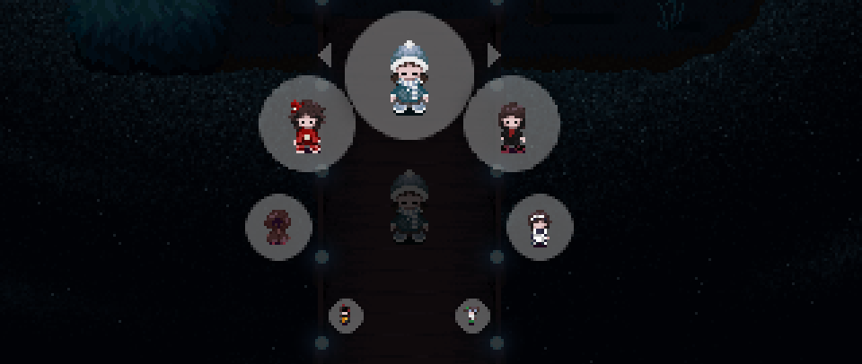

# Collective Unconscious guidelines

**Collective Unconscious** is an open, collaborative game project inspired by Yume Nikki and its fangames, developed in RPG Maker 2003. You control Minnatsuki, a mysterious character wandering around a dream-like world full of spirits and otherworldly beings.

The game is exclusively made for an online multiplayer experience, and hosted under the [Yume Nikki Online Project](https://ynoproject.net) website. Anyone can contribute to the project, as long as they respect the submission procedures and rules outlined in the #guidelines channel on Discord.

## Table of Contents

- [Introduction](#collective-unconscious-guidelines)

- [What's a Developer? What's a Contributor?](#whats-a-developer-whats-a-contributor)

- [Becoming a Developer](#becoming-a-developer)
	- [The Dev Checklist](#the-dev-checklist)
 	- [What if I leave the project?](#what-if-i-leave-the-project)

- [Developing - Connecting Maps](#developing---connecting-maps)

- [Becoming a Contributor - Using the Repository](#becoming-a-contributor---using-the-repository)
	- [What's a repository?](#whats-a-repository)

- [Contributing a Book Cover](#contributing-a-book-cover)

- [Contributing Vending Machine Items](#contributing-vending-machine-items)

- [Contributing Menu Themes](#contributing-menu-themes)

- [Contributing Terrains](#contributing-terrains)

- [Contributing Pseudo-eidola](#contributing-pseudo-eidola)

- [Contributing Visages](#contributing-visages)

- [Maniac Patch Guidelines](#maniac-patch-guidelines)

## What's a Developer? What's a Contributor?

There are two ways in which you can contribute to Collective Unconscious:

- **Becoming a Developer**: A Developer can add something to the game which requires a reservation of database entries (maps, switches, variables, tilesets and battle animations). This role is represented in the server as @Zone Weaver (Developer).
- **__Becoming a Contributor__**: A Contributor can add something to the game which does not require any database entries to be reserved (music, sound effects, pictures, panoramas, unlockables, etc). This role is represented in the server as @Wandering Ghost (Contributor).

You will obtain the role of Contributor or Developer as soon as your content is added in one of the game's updates.

## Becoming a Developer

### How can I become a Developer?

1. Check the ⁠#read_me_👁, ⁠#guidelines, and #⁠important_links channels, as well as this wiki, thoroughly. It's a long but very important read!
2. Fill out the **[Skills Base document](https://docs.google.com/spreadsheets/d/1Jq7XSVAZD1meZjSY4yYEZBC-cbbsN585tZNbx30Cd5I/edit?usp=sharing)**  with all the needed information.
3. **Contact any @Spirit Guide (Manager)** to reserve database entries, as well as specifying your chosen Developer name for the game.

> - You will be given the @🗝️ Spirit Key role, which grants you access to the build.
> - You will then be given 10 database entries each for maps, tilesets, variables and switches. You can also reserve 10 battle animations entries if specifically requested.
> - Your reserved entries only belong to you and no other @Zone Weaver (Developer). If you decide you no longer can or want to use them, you should tell any @Spirit Guide (Manager) so the entries can be cleared.
> - Your database entries are visible in the **[Reservation List document](https://docs.google.com/spreadsheets/d/1H-f9iXSCZMGhCLny914neOCTLkf89xB_SwjTWR7UfJo/edit?usp=sharing)**.
> - Please pick a developer name that you will feel comfortable keeping, as changing it is an laborious process.
4. Make sure what you are developing is always **up to date** with the latest version of the game. You'll get access to the build after having reserved database entries.
5. **Use our dev checklist and changelog template** to prepare your submission properly. This is a very important step and half of the work of a Developer, so **don't rush it**! Both of these documents can be found down below.
6. **Write an explanation for any complex or hidden events**. This will be used by managers during playtesting. You can include it in the changelog or as a separate file, if you would like it to remain hidden (as changelogs become public after release).
> - **What counts as a complex event?** This is any event whose workings cannot be quickly discerned upon opening a single event tile. This includes things like events using local switches and variables (as they cannot be renamed to explain their uses clearly), events with multiple page states that aren’t just tied to simple conditions like equipping an effect, and puzzles with multiple steps (solutions for puzzles should be included). When in doubt, it is better to over-explain than under-explain, so either include those that you’re unsure of or simply ask!
7. **Send your submission in a compressed file** (.rar or .zip) to any @Spirit Guide (Manager)  when submissions are open. If it's too big for Discord's file limit, you can use Mediafire, Mega, or catbox.
Here's an example of how the inside of your zipped file should look like (please sort them out properly in their respective folders!):

*The archive should contain your changelog and your submission folder, which should contain the game files.*

8. **Be prepared for potential bug fixing.** You should have playtested your maps before sending them to us, but it is possible you missed some bugs. If so, a @Spirit Guide (Manager) might DM you about it to fix them. Sometimes we will fix those ourselves, and sometimes you will have to take on that job and send your submission again. Be ready for it!
9. **Be prepared for potential rejection.** If your submission has too many bugs or doesn't follow our rules and guidelines properly, it might not be accepted immediately and will have to undergo some changes on your side. Don't worry though, we will let you know what's wrong and give you some feedback on how to fix it. If you follow this feedback properly, we will reevaluate your submission. If it is found to meet the guidelines, it will be accepted.
10. Unless some changes are still necessary, your content will appear in the game in the next update. **Congratulations!**

If you have any more questions or need clarifications on the process, let us know. Also consider reading through the [Developer's Handbook](https://docs.google.com/document/d/1eo9GmPM5MAAsaz1KWY_RLCBH8NZ1pUcQx6J3LlVsnMQ/edit?usp=sharing), which contains documentation of switches, variables, and common events, frequently asked questions, and various guidelines and tutorials.

Thank you and good luck, we are all looking forward to see what you create.

### The Dev Checklist

**GENERAL**
- [ ] Your submission follows the guidelines
- [ ] You are working on the latest dev build
- [ ] Your are using your own database entries IDs 
- [ ] You are allowed to use the assets you are using

**PLAYTESTING**
- [ ] Passability is properly set on all tilesets/events
- [ ] All events work and interact properly with all effects/keys
- [ ] All warps work properly, both ways
- [ ] All warps (world-to-world AND warps within the same map/world) include the following CEs: 11 - Disable Actions, 12 - Enable Actions
- [ ] All world-to-world warps include the CE 20 - Map Transition
- [ ] All images/parallaxes are properly placed, regardless of the connection from which you enter the map
- [ ] All music/sound effects work and loop properly, and are well-balanced

**FILES TO INCLUDE**
- [ ] RPG_RT.lmt
- [ ] RPG_RT.ldb
- [ ] New **and** edited maps *(.lmu)* [⚠️ Don't forget the updated maps with your new connections ⚠️]
- [ ] New **and** edited tilesets
- [ ] New **and** edited charsets
- [ ] New **and** edited music files *(.wav)*
- [ ] New **and** edited sound effects *(.wav)*
- [ ] New **and** edited panoramas
- [ ] New **and** edited pictures
- [ ] New **and** edited battle animations

**CHANGELOG**

**[Changelog template text file](changelog_template.txt)**

**Please download and use the template provided above, or use the changelog generator below.**

- [ ] Your developer name is shown
- [ ] The date is shown
- [ ] Your changelog is properly formatted

- [ ] Map policy
     (who is allowed to edit and/or add content to your maps, and in what ways: open connections only, can create a warp but it has to be this specific shape/color, etc.)
- [ ] Asset policy
      (who is allowed to use and/or edit the assets you made)

- [ ] Added/Edited/Removed maps (ID and name) 
	- [ ] Official world names to be included on the wiki are specified
	- [ ] Subareas are specified
	- [ ] Inaccessible maps are clearly marked
- [ ] Added/Edited/Removed connections (one-way/both-way/unlocked connection from the other side)
     - **Don't forget to write down the coordinates of the warps!**
     - Note: you only have to note connections from a world to another!
- [ ] Added/Edited/Removed open/closed connections (if you've added/removed an open/closed connection, if you've changed the coordinates of one, if you or another dev has taken one)

- [ ] Added/Edited/Removed tilesets, switches, variables, animations, systems (ID and name)

- [ ] Music details per map, including filename, volume, and tempo
- [ ] Events that contain a music change and their coordinates on the map (needed for record player)
- [ ] If you've modified the music of a map/event (needed for record player)

- [ ] Added/Edited/Removed assets (charset, chipset, music, sound, panorama, picture...)
	- If they were made by other contributors, credit them!

**PATCH GENERATOR**

Mossball is a program which automatically generates both the changelog and the compressed patch file. You can download it **[Here](https://github.com/lumiscosity/mossball/releases)**.

**Usage:**

You will be asked first to select an unmodified copy of the most recent build, then the copy you edited. **You have to select the folder that directly contains the project files (MapXXXX.lmu and others)**. You can then select the individual files to include or exclude, then proceed to creating a changelog. Mossball will automatically detect BGMs in maps and connections.

**Don't forget to add your developer name, policies, open connections and menu theme names!**

**Support:**

If you encounter any issues with Mossball, please contact @lumiscosity.

Mossball is licensed under the GPLv3. More information and the included libraries can be found in the [official repository](https://github.com/lumiscosity/mossball).

### What if I leave the project?
In the event that a developer leaves the project and is uncontactable for one year (including being specifically asked not to be contacted) and no alternatives have been specified, the following default rule will take effect:

- The developer's maps can be updated to support new eidola as applicable.
- If the map has open connections or was listed in the Map and Asset Policy as "message to connect", anyone can add a connection.
- Closed connections will remain closed and may be blocked off so that players recognize they will not be updated in the future.

At any time, a developer may update their Map and Asset Policy to specify an alternative set of rules, including on a per-map basis. (Examples: one map cannot be touched at all, a specific developer inherits certain maps, all maps can be freely edited, etc.)

## Developing - Connecting Maps

### What guarantees that I can connect my map to another map?

Collective Unconscious uses a system that helps you identify if a connection is closed (X) or open (O).
- Any warp/path having an "X" sign means other developers can't connect their maps to it.
- Any warp/path having an "O" sign means other developers can connect their maps to it.

If a path is blocked without any of these indications, you have two options: either check the @Zone Weaver (Developer)'s map policies, or assume it is a closed connection (unless it is a Nexus world).

*Closed (X) and Open (O) connection signs*

### How do I submit an open connection?

Simply place an open connection sign in your world at the desired location and **note it in your changelog** (including the coordinates). A @Spirit Guide (Manager) will add it to the [Connections Document](https://docs.google.com/spreadsheets/d/1D1gn9FtWGWsrHylgFvlNQ6Uar0kHx7S-ULzVR7iLpZE/edit#gid=0) when the new build is released.

> Please try to keep worlds to **5 open connections or fewer**. You can discuss with a @Spirit Guide (Manager) if you think your world calls for more connections, but it is likely to not be accepted except in rare circumstances.
> 
### How do I claim an open connection?

1. **Check the Connection Requests page** (page 3 of the [Connections Document](https://docs.google.com/spreadsheets/d/1D1gn9FtWGWsrHylgFvlNQ6Uar0kHx7S-ULzVR7iLpZE/edit#gid=0)) to see if the connection you want is free. 

2. **Talk to the @Zone Weaver (Developer) of the world and confirm whether they’re okay with you taking the connection.** Even if it is an open connection, it’s best practice to discuss it with the dev. If you can’t contact the developer for some reason, contact a @Spirit Guide (Manager). 

3. **Fill out the [Connection Request form](https://forms.gle/vzCzeJU4sJxkMDNP9)**. Cross reference the document to get the correct connection letter and world number. Everything needs to be formatted *exactly* as the instructions say, or else your request *will not be added*!

4. **Confirm that the Connection Requests page added your submission**. If it did not, you may have put in information incorrectly, so please try resubmitting or contacting @nacremoon or another @Spirit Guide (Manager).

5. If you no longer wish to claim an open connection, **contact @nacremoon to have the request removed**.

### How does the Connections document work?

The [Connections Document](https://docs.google.com/spreadsheets/d/1D1gn9FtWGWsrHylgFvlNQ6Uar0kHx7S-ULzVR7iLpZE/edit#gid=0) has three pages: 1 Connections (Depth), 2 Connections (Priority), and 3 Connection Requests.

#### Connections (Depth) and Connections (Priority)

The same page, just organized differently. These pages show in-depth information on each world in the game, organising them by depth (with the Nexus being 0) and priority respectively. These pages show the status of the most recent build on release and will not be updated until the next build is released. 

#### What is Priority?

Priority is a measurement of how important it is that the open connections in the world be filled. Older, lower depth worlds with fewer connections take higher priority. You can take any connection that is available, but please give special consideration to high priority ones. Events like Collective Creations will also be run throughout the year to focus on filling high priority connections. 

The priority formula works as follows:
- Amount of children: 25% $\times$ (the less child worlds -> higher value)
- Open connections: 25% $\times$ (the more openC -> higher value)
- Depth: 30% $\times$ (the lower depth -> higher value)
- Version: 20% $\times$ (the older version -> higher value)

#### Connection Requests

This page is connected to the Connection Request form. It is the source of truth for who has taken a connection, in order to avoid conflicts. Form submissions operate on a **first come, first serve basis** (i.e. if you submit for a connection someone has already claimed, your request will not overwrite theirs). The page is ordered by priority.

#### What if I see incorrect information?

Contact @nacremoon. Any missed connections will be manually added. Anything not currently in the build will not be added to the document. Information may be removed in extreme cases, such as your entire world getting an overhaul and no current connections being relevant anymore.

The open connection process has been formalized in order to avoid conflicts on connection claims.

> For any inquiry about the connection process, **please contact @nacremoon**.

## Becoming a Contributor - Using the Repository

### How can I become a Contributor?

First and formost, you should fill out the **[Skills Base document](https://docs.google.com/spreadsheets/d/1Jq7XSVAZD1meZjSY4yYEZBC-cbbsN585tZNbx30Cd5I/edit?usp=sharing)** with all the needed information.

There are two ways of becoming a contributor:

1. **Uploading the content** you wish to contribute to the contribution repository. Please note that there is no guarantee your content will be used, unless you:

2. **Bundling your content along with a @Zone Weaver (Developer)'s update**, if you and the Developer have decided to work together. In that case, there is no need to use the content repository (unless you want other Developers to be able to use your content!). Make sure you are credited when the Developer submits their update.

> Please pick a contributor name that you will feel comfortable keeping, as changing it is a **laborious process**.

### What's a repository?

The repository is a database containing a collection of various assets (music, sounds, charsets, tilesets, panoramas...) made by other Contributors. Developers can use any of these assets on their maps, as long as they credit the Contributor.

### How can I access the repository?

1. **If you want to add files to the repository**, contact a @Spirit Guide (Manager) so she can give you access to a specific channel explaining the process. The @🗝️ Spirit Key role also gives you access to this channel!
> -  Your music and sound files should always be in __wav__ format.
> - Music files must be limited to 30 characters.
> - It is highly recommended to put your contributor name in the file name as a __prefix__ (like this: contribname_title.wav)
> - We highly recommend that you add a __read_me text file__ containing your asset policies, explaining how others can use your assets.

2. **If you want to use any of the assets as a Developer**, make sure to check if they have any [asset policy](https://docs.google.com/document/d/1n1d-eS4kl3Ko6LEhN78mEz9o9rKHYkkLhPkZdNQZ5FM/edit?usp=sharing), and let the Contributor know you are using their asset. If you don't get an answer from them, and you are respecting their policy, you can assume you are allowed to use their assets!

## Contributing a Book Cover

### What is a Book Cover?

Book covers are collectibles similar to Yume 2kki's PC wallpapers. They are unlockable under certain conditions (visiting a map, interacting with an event, etc.). Anyone can contribute a book cover as long as they follow the requirements!

### How to make a Book Cover?

__Cover specifications:__
- Image dimensions of 218x282 pixels (width, height)
- RGB color accepted (8-bit indexed is not required)
- PNG format
- No transparency

Your cover image will be animated by a script to match the book's opening animation, so some parts of the original image will not be visible when the book is closed. You can use this template to work your design around that.

- **Green:** Visible when the book is closed.
- **Blue:** Visible only during animation.
- **Grey:** Only visible on thumbnails.

To make the cover design look nice with the notebook rings, we recommend avoiding bright and saturated tones in the leftmost edge of the cover design. A subtle gradient or side pattern can help if your design uses brighter tones.

All relevant information is compiled into the images below for quick reference:

### How to submit a Book Cover?

Fill in the **[Google Form](https://docs.google.com/forms/d/e/1FAIpQLSe3zY1jmUGhdrv9WaZIjL-nYJ4rOTnKG7ORTgASaqLtPcN1aA/viewform)** with all the necessary information:
- Title
- Contributor name
- Detailed description of the conditions required for the player to obtain/unlock your cover
- Direct link to your image (catbox or Imgur)

## Contributing Vending Machine Items

### What are Vending Machine Items?

Vending machine items are another type of collectible that can be found by interacting with a vending machine.

### How to contribute Vending Machine Items?

Every step is explained in stylzm's **vending machine tutorial document** that can be found right below. However, before submitting an item, there is a reservation process to follow:

1. Reserve battle animation entries.
2. Once you are **100% sure** your item is done and ready to be implemented for the next build, **contact a @Spirit Guide (Manager) to reserve a vending machine item slot** for it.
3. You can now follow the tutorial and send us an update with the new items (don't forget to write it in the changelog)!

This process is here to prevent overlapping of vending machine item IDs in case someone else has submitted an update with a new item, and to make sure no empty slots are left in the big vending machine gallery on release.

**[Vending machine tutorial PDF file](vending_machine_tutorial.pdf)**

## Contributing Menu Themes

### What are Menu Themes?

Menu Themes are a type of collectible that can be found in worlds, changing the look of a player's menu. They can be obtained by a variety of means, from simply interacting with an object to completing events. 

### How to contribute Menu Themes?

Similar to vending machine items, there is a reservation process to follow before submitting a menu theme:

1. Make **100% sure** your menu theme is done and ready to be implemented for the next build. This includes creating a finalised system file (menu theme), as well as setting up/making sure of the conditions for obtaining said menu theme in game. 
> If your menu theme is obtained from interacting with an object, make sure you are sure of and have completed the designated location for it.
> If your menu theme is obtained after an event, make sure the creation of that event is completed.

2. Once you are 100% sure your menu theme is done and ready to be implemented, **contact a @Spirit Guide (Manager) to reserve a Menu Theme ID**.
3. Once you have been given your Menu Theme ID, edit **CE 29 - Reset Menu Theme**:

- Scroll down to the bottom of the CE and create a new conditional branch. The easiest way to do so is to copy a previous entry.
- Edit the conditional branch and change the constant number to your given Menu Theme ID.
- Edit the change system graphic command to your own menu theme.

Below is an example of how your entry should be formatted:

*A conditional branch on variable 0116 encapsulates a 'Change System Graphic' command.*

4. Implement your **Menu Theme event**.

The important commands are:
- Setting Variable 91 to your given Menu Theme ID.
- Calling CE 28 - Unlock Menu Theme.

Below is an example of what a menu theme unlocked by interacting with an event looks like:

5. **OPTIONAL** - create a Menu Theme cube. 

If your menu theme is unlocked by interaction, you can create your own Menu Theme cube graphic to go with it! 
- Edit the charset awu_menuthemes.png to include your menu theme cube graphic
- Submit the edited charset along with your update (make sure to write it in the changelog!)

Note: Menu Theme cubes are the recommended standard for all menu themes, but you can still create your own custom graphic/method of obtaining if you'd like.

5. Send us an update with the new menu theme (don't forget the changelog)!

Disclaimer: Although you have finished these tasks, note that your menu theme has **not been fully implemented yet**! Managers have to take care of updating CE 28 - Unlock Menu Theme, as well as implementing your menu theme in the book. By helping us with the tasks above, you can make things all the more easier for us <:uroSleep:1193890857452052561> 

The reservation process is here to prevent overlapping of Menu Theme IDs in case someone else has submitted an update with a new menu theme, and to make sure no empty slots are left in the book on release.

## Contributing Terrains

### What are Terrains?

Terrains allow for the different step sounds you hear in maps. Similar to vending machine items and menu themes, they require a reservation process.

### How to contribute Terrains?

1. Once you are **100% sure** your terrain sound is ready for the next build, contact a @Spirit Guide (Manager) to reserve a Terrain ID. 
> Note that you will be given **2 IDs for a terrain**. Each terrain requires a regular ID, as well as an alternative ID (Alt). This is so Developers can implement shadow tinting via terrain in their maps if they wish.

2. Once you have been given your Terrain ID, **edit CE 16 - Coord/Step Calc**:

For each new terrain, you have to add a conditional branch. It always is formatted like this:
@>Conditional Branch: Variable [0040:Terrain ID] == `Number`
       @>Comment: `Name` Terrain ID
       @>Play SE: '`Sound effect file name`', values
       @>Jump to Label: 1

- Scroll down to the bottom of the CE and create a new conditional branch. The easiest way to do so is to copy a previous entry.
- Edit the conditional branch and change the constant number to your given Terrain ID.
- Edit the comment to reflect the name of your terrain ID.
- Edit the Play SE command to your own terrain sound.
- Make sure to create another conditional branch for the alternative ID (Alt).

Below is an example of how your entry should be formatted:

3. In the "Terrain" section of the database, **increase the maximum number of terrains** and **add a name to your terrains**.

> ⚠️ It is important that here, you **do not set terrain sounds using the in-engine footstep sound picker**. Terrain sounds are done through the Coord/Step Calc CE instead in order to easily allow effects (eg. Lumen and Spectral) to have custom step sounds.

4. Make sure you playtest your footstep sounds to see if their **volume level is well adjusted** in comparison to other footstep sounds/menu sounds!

5. Send us an update with the new terrain (don't forget the changelog)!

This reservation process is here to prevent overlapping of terrain IDs in case someone else has submitted an update with a new terrain.

## Contributing Pseudo-eidola

### What are Pseudo-eidola?
Pseudo-eidola (often referred to as pseudos) are cosmetic changes to Minnatsuki outside the core supported eidola and boats and not encompassed in [custom protagonist sprites](https://docs.google.com/document/d/1eo9GmPM5MAAsaz1KWY_RLCBH8NZ1pUcQx6J3LlVsnMQ/edit?pli=1&tab=t.0#heading=h.mk2du8auk1jy). These can be equipped via any event but are commonly seen as outfits the player can pick up in the Spirit World. Pseudos can optionally have an action on the 1 key (this is added by modifying CE 13: Effect Action).

### Pseudo-eidola guidelines
All pseudo-eidola must follow the following guidelines.

- Pseudo 1 key actions should be mainly cosmetic; there is no expectation for other developers to incorporate or accomodate your action like one would with eidola.
- A pseudo’s home world or area (depending on continuity, like a themed route or sector) can have major interactions (like revealing collectibles and connections), but unrelated worlds should be limited to minor interactions that don’t strongly impact gameplay/are cosmetic (such as an NPC reacting to the pseudo), unless they are very well telegraphed (these will be judged on a case by case basis).
- Interactions should make thematic sense and not be obtuse/obscure (for example, a maid or butler NPC reacting to the maid pseudo makes sense, but a random NPC with no telegraphed connection to maids or service workers reacting doesn’t).
- All pseudos must fit within the standard 24x32 charset cell size, unless they are going to be only accessible in an isolated world where extra size can be accomodated.

### How to contribute pseudo-eidola
Follow the instructions present in the [Adding pseudo-eidola](https://docs.google.com/document/d/1eo9GmPM5MAAsaz1KWY_RLCBH8NZ1pUcQx6J3LlVsnMQ/edit?pli=1&tab=t.0#heading=h.mlu9st8wa7qe) section of the developer's handbook to create your pseudo.

Modify CE 13: Effect Action if you wish to add a 1 key action.

In the Debug Room, at (009,032), there is an event with basic code for equipping a pseudo. You are free to copy this into your world, just make sure to change all switches appropriately.

Make sure to thoroughly playtest all actions (sitting on benches, climbing ladders, entering and exiting boats) and gestures to make sure implementation was done correctly! Include the pseudo's equip location in your changelog on submission.

## Contributing Visages

### What are Visages?
Visages are [pseudo-eidola](#contributing-pseudo-eidola) that can be equipped via the Visage eidolon at any time.

### How to contribute Visages
1. Once you are 100% sure your visage is done and ready to be implemented (make sure it follows all of the rules and guidelines seen above!), contact a @Spirit Guide (Manager) to reserve a Visage ID. If you did not create the visage and are just adding it to your world, make sure to tell the manager who created it. Your reservation will be denied if the visage is not completely ready!
> If your visage is obtained from interacting with an object, make sure you are sure of and have completed the designated location for it. If your visage is obtained after an event, make sure the creation of that event is completed.
2. Specify a switch for unlocking your visage.
3. Once you have been given your Visage ID, edit CE 87: Visage Menu Check.
> - Copy an existing block, starting with Conditional Branch: V[0175:Circle Menu - Temp5] ==
> - Change both the outer and innermost conditional branches to point to your visage ID. 
> - Change the middle conditional branch to use your visage unlock switch.
4. Edit CE 88: Handle Visage.
> - Copy an existing block, starting with Conditional Branch: V[0081:Circle Menu - Cursor] ==
> - Change the conditional branch to point to your visage ID.
> - Change the switch control to turn your visage equip switch on.
5. Add a picture titled “pseudos_{3 digit ID}” that is 24x32, showing the front facing standing sprite of your visage.
6. In the event where your visage is unlocked, add a block of code showing the unlock notification (see the Pseudo Equip event in the debug room at (009,032) for an example).
7. Make sure to playtest thoroughly!
8. Send us an update with the new visage (don't forget the changelog)!

The reservation process is here to prevent overlapping of Visage IDs in case someone else has submitted an update with a new Visage, and to make sure no empty slots are left in the Visage menu on release.

## Maniac Patch Guidelines

Maniac patch is a patch for RPG Maker 2003 which adds a lot of new commands, and expands some commands.
It is partially supported by EasyRPG Player, the engine used by the game, and most of its features are supported (a status on the support of commands in EasyRPG Player can be found here: https://github.com/EasyRPG/Player/issues/1818).

For those wanting to get started with it, an English guide on installing the Maniac patch as well as using some of its commands is available here: https://www.rmteka.pl/in-english/

Note that some commands/some parts of commands may not be accessible without using TPC, an external program that can be used with Maniac to manually write commands. If you are unfamiliar on how to write a specific command using TPC, you can check Jetrotal's Cold Spaghetti Analyser, allowing to check the formatting of commands using TPC: https://jetrotal.github.io/CSA/

While the patch can be used for developing on Collective Unconscious, some limitations will exist on commands:

### New Commands Allowed Without Restrictions:

Get Picture Info - Get info of a picture.

Control Var Array - Allow to edit an array of variables.

Get Game Info - Get info of the game, such as the size of the map, the tileset ID, the screen position...

### New Commands Allowed With Restrictions:

Get Mouse Position - Get the X and Y coordinates of the mouse of the player. If the player is playing on mobile, this will instead track where the player has tapped on the screen in the window of the game, with the coordinates being kept as-is until being touched once more. (the difference between those two platforms implicate for instance that while on PC, a player could be expected to have their mouse follow a specific route to go from a point A to a point B, while on mobile, it could just teleport between the point A and B). Since mouse/touch control is a type of interaction not used in the base game, having this needs to make sense and be understandable for the player, especially if it is required to access content. Consider testing your content if it uses this command both on a computer and a mobile device if possible.

Show String Picture - Display a picture where text can be typed. Can be combined with String Variables for even more flexibility. Do not use custom fonts outside of the ones provided in the Font folder of the game (requires to bundle a license with, and needs to deal with translations having to adjust to it if the needed characters are missing). Keep in mind that implementation of text is still reviewed on a case-by-case basis, per the guideline 12. Current implementation of this command in EasyRPG Player is not 100% accurate to how it is in Maniac: expect the display to potentially slightly change in the future.

Key Input Processing EX - Allow to track the use of any key from the keyboard. While this command is allowed, mobile players lacking access to a keyboard, those players should not be prevented from enjoying the game to its fullest due to not playing on a computer. As such, if you plan to use this command, an alternative option must be presented for mobile players. Tracking keys that already exist in Key Input Processing is possible, and allow to be more precise for some shared keys such as the cancel or interaction keys, though keep in mind that all of the mouse keys are also not accessible on mobile. Since this is a type of interaction not normally used in the base game, having this needs to make sense and be understandable for the player, especially if it is required to access content. Do no track uncommon keys that wouldn't be found on most keyboards (F24, Stop Media key, Volume Down Key...), and do not track keys specific to regional keyboards (;:, -, /?, those types of keys). Buttons from a controller can be tracked in Maniac, but is unsupported in EasyRPG, so do not use this part of the command. Consider testing your content if it uses this command both on a computer and a mobile device if possible.

Rewrite Map - Allow to rewrite tiles of the map, with changes not being saved when leaving the map or saving and reloading the save. Do not use out of bounds and invalid tiles. Partial A and B autotiles are currently unsupported by EasyRPG Player, so do not use them.

Call Command - Allow to indirectly call another command. Only recommended for advanced users. Make sure you're only calling correct commands using this.

### Forbidden Commands:

Get Save Info - Get info from a save file by specifying a save ID. Info in question is when the save file was last saved, the level (Number of Eidola + 1) and HP of the first character in the party (Minnatsuki), as well as the FaceSet of each member of the party (just Minnatsuki). No purpose here: the current save file used by the player is not known, so no real way to know when they last saved. Outside of that, knowing the current level and HP of the player can already be tracked, with knowing the previous values not being of much use, and the FaceSet of Minnatsuki is predefined when saving so already known, meaning that none of this should be used. 

Save - Do a save by specifying a save ID. Saving outside of Minnatsuki's Room is outside of the scope of the game, so this command should not be used.

Load - Load an existing save file by specifying a save ID. Loading a save outside of Minnatsuki's Room is outside of the scope of the game, so this command should not be used.

End Load Process - Command with no effect, do not use it.

Set Mouse Position - Not supported nor planned for EasyRPG Player (system specific not exposed by SDL).

Control Battle - Control some commands of the battle system, which is not used by this game.

Control ATB Gauge - Control the ATB gauge of the battle system, which is not used by this game.

Change Battle Command EX - Edit some of the commands of the battle system, which is not used by this game.

Get Battle Info - Get infos on the current battle, though the battle system is not used by this game.

Control Global Save - Allow to write data to a save file shared between the different save slots. Data here wouldn't be reliable, due to the player being potentially expected to switch between playing on PC and on mobile, with the global save not being shared between the different devices.

Change Picture ID - Change the ID of a picture. Currently unimplemented by EasyRPG Player.

Set Game Option - Adjust some settings of the game throughout its entirety. Currently unimplemented by EasyRPG Player, and those settings wouldn't be useful since most of them are for debug purposes.

### Expanded Commands

When using an expanded command, it is highly recommended to add a comment above it in the code to specify that the command uses the Maniac patch, especially if the code in question is expected to be checked and edited by other developers and managers. Editing the command using the vanilla editor could remove the added functions by error, potentially breaking how the command was expected to work.

### Expanded Commands Without Restrictions:

Show Picture - Horizontal/vertical inversion, angle designation, blending mode, origin specification, and variable number for some of its parameters were added.

Move Picture - Horizontal/vertical inversion, angle designation, blending mode, origin specification, and variable number for some of its parameters were added. A negative move time is now handled in frames.

Play BGM - Values can be replaced by variables, and the name of the file can be replaced by a String Variable. Make sure to list for managers in the changelog the name and values to be used in the Record Player.

Play SE - Values can be replaced by variables, and the name of the file can be replaced by a String Variable.

Wait - Variables can now be used.

Loop - It is now possible to adjust how many times the loop loops, or until something occurs.

Break Loop - Fixed an issue where the indenting was incorrect when called in a multiple loop.

### Expanded Commands With Restrictions:

Erase Picture - Variable number for some of its parameters were added. Erasing All Pictures was added, but is not authorised to be used to avoid conflicting with system pictures.

Conditional Branch - Variable reference, variable of the variable number, comparing a variable to a variable were added. It is also possible to check if the save file has just been loaded, if a controller is enabled, or if the window of the game is active or not, but those conditions should not be used (unsupported by EasyRPG Player + the player is not loading a save when reaching your map anyways; player may or may not have a controller, and using a controller or not does not change the keys, so locking content behind that wouldn't make sense; mobile players cannot necessarily easily go on another window without possibly encountering issues, in addition to not making sense).

Key Input Processing - Mouse left, mouse right, and mouse middle can now be tracked. While playing on mobile, mouse left corresponds to using one finger on the screen, mouse right two fingers, and mouse middle three. Since this is a type of interaction not normally used in the base game, having this needs to make sense and be understandable for the player independently of the platform, especially if it is required to access content. Wheel up and wheel down can also be tracked, but cannot be used on mobile. As such, if you plan to use this command, an alternative option must be presented for mobile players. Consider testing your content if it uses this command both on a computer and a mobile device if possible.

Control Variables - A lot of new options were added for this command: make sure to tick in the Options of the editor "Use new 'Control Variables'" to have access to them. Do not track the date, time, number of frames elapsed, current version of Maniac patch, anything tied to the battle system, and anything in terms of switches, variables, and system that you shouldn't touch. The expression format is not fully supported by EasyRPG Player, so do not use it.

Call Event - A common event can now be called by a variable number. Make sure you call a valid common event.

Control String Variables - Allow to store text in a new set of variables called String Variables. This command can be used in a lot of different ways, but notably for displaying text, or for storing filenames for use in existing commands. Ranges for the variables are the following: 1-20, local variables, 21-100, system variables, 100+, developer variables per batch of 10, to be requested to your nearest manager. It is possible to extract text from a text file using this command, located in the Text folder. Developers wanting to use a text file should have their be put in a subfolder of the Text folder, named after their developer name. While this command allows to write data to a text file, you are not allowed to do that. Text expected to be translatable in other languages should not be put in a text file, due to not wanting to deal with conflict issues depending on the language, and should not be taken from an untranslatable field, such as the name of an event or the name of an element in the database. Elements expected to be translated should not be kept in memory after returning to the real room, to avoid them from being made untranslatable if the player were to change their language. Do not take data from a field you're not supposed to look into (e.g. skill list, tileset list...). If you use this command to show text, keep in mind that implementation of text is still reviewed on a case-by-case basis, per the guideline 12.

Erase Event - Can now be used to bring back an erased event, and can be supplied an ID. Make sure to call a working event.

Scroll Map - It is now possible to move the camera per pixel. Make sure it is properly reset when leaving your area.

### Forbidden Expanded Commands:

Battle Processing - The flash can now be disabled when a battle is set to start. Not to be used since the battle system is not used in this game.

### Other

If a command or expanded command is not mentioned, but you would still like to use it, ask to a manager if using it wouldn't be an issue, and make sure that the command is properly supported in the EasyRPG Player and fully accurate to the Maniac patch.
